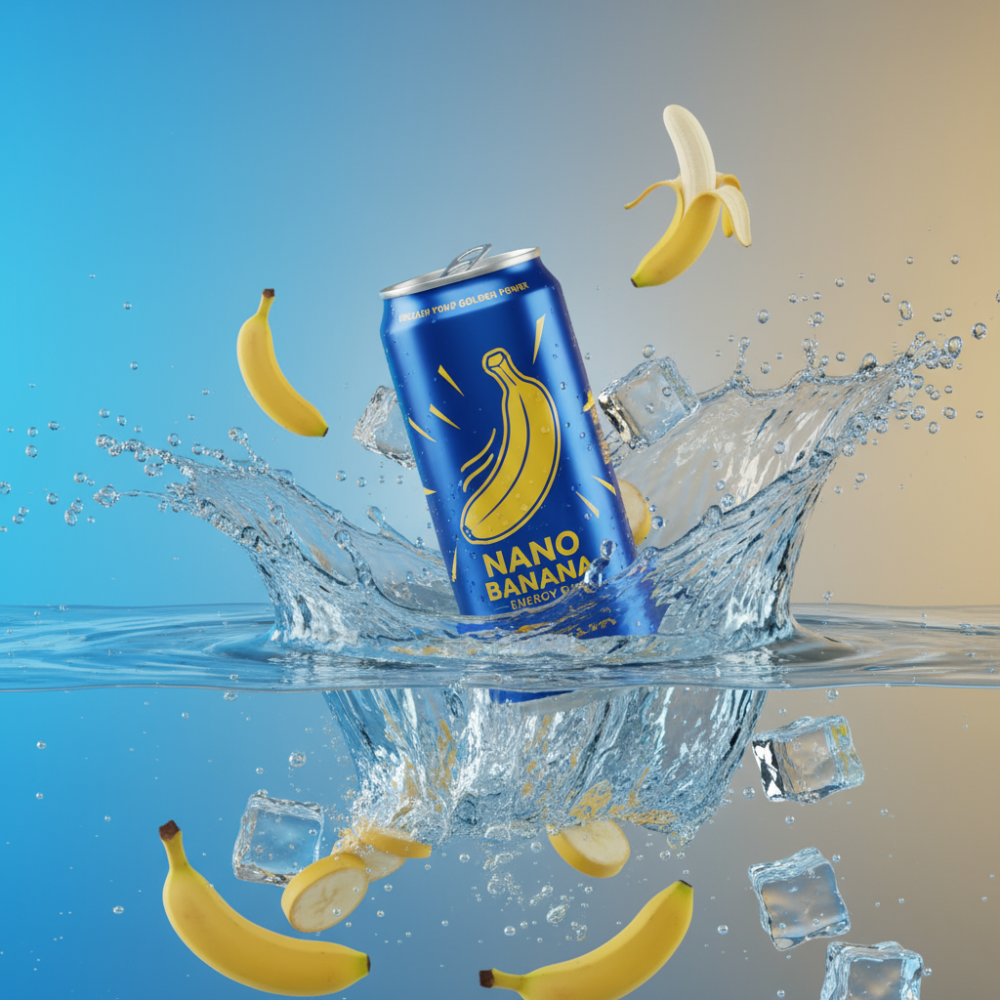

Image AI Generator – Marketing Image Generator

Image AI Generator is a professional digital advertising content generator built with React, Supabase, and Tailwind UI.

It helps agencies and marketers create eye-catching visuals for social media, banners, product ads, and more.

✨ Features

✅ 🎨 Prompt-to-Image Generator – Describe your product/brand and generate visuals

✅ 🏢 Agency-Specific Use Cases – Optimized for:

🚀 Full Service Digital Agencies

📱 Social Media Marketing Agencies

🔍 SEO/SEM Specialists

✍️ Content Marketing Agencies

✅ 🖼 Ad Format Support – 1:1, 16:9, 9:16 ready

✅ ⚡ Supabase Edge Functions for AI image generation

✅ 🔔 Smart Toast Notifications with error handling

✅ 📥 One-click Download of generated ads

🚀 Tech Stack

⚛️ Frontend: React + Vite + TailwindCSS + ShadCN UI

🗄 Backend: Supabase (Edge Functions for AI)

🎨 UI Components: Lucide Icons, ShadCN Cards, Buttons, Textarea

🔔 Notifications: Sonner

🌀 State Management: React Hooks

📦 Installation:

# Clone the repo

git clone https://github.com/HarmonJavier01/creative_banana.git
cd nano-banana-ai

# Install dependencies

npm install

# Run the dev server

npm run dev

# Build for production

npm run build

🔑 Environment Variables

Create a .env.local file and add your Supabase keys:
VITE_SUPABASE_URL=your_supabase_url
VITE_SUPABASE_ANON_KEY=your_supabase_anon_key

⚡ How to Use the App

1️⃣ Start the app → Run npm run dev and open in browser

2️⃣ Describe your image → Enter a creative prompt

Example: "Nano Banana drink can on a beach at sunset, vibrant colors"
3️⃣ Select Agency Type → Choose 🚀 Full Service, 📱 Social Media, 🔍 SEO/SEM, or ✍️ Content

4️⃣ Pick Image Format → 1:1 Ad, 16:9 Banner, Product Image, Social Square, or Story

5️⃣ Generate → Click Generate Image and wait for the magic ✨

6️⃣ Download → Save your ad with one click 📥

📸 Example Preview

Prompt:
Nano Banana energy drink can splashing into ice water with golden bananas

Result:

🛠 Development Notes

➕ Add new agencies → edit agencies array

➕ Add new categories → edit categories array

⚡ Backend AI calls handled by Supabase generate-image function

📜 License

MIT License © 2025 – Built with love for creative marketers.
